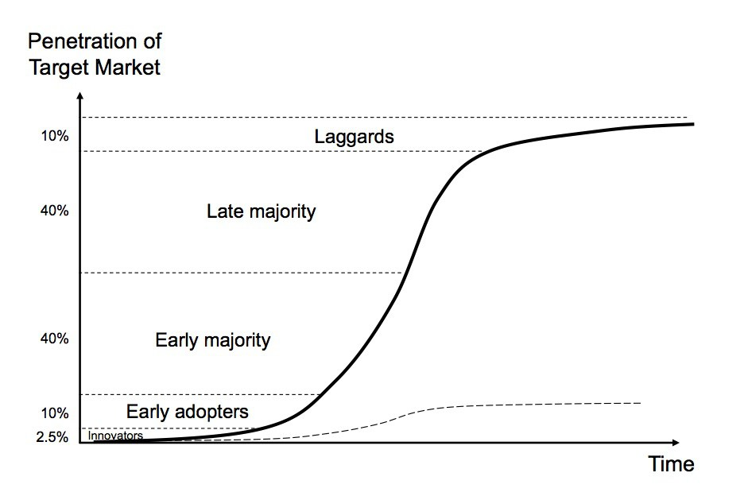

<!-- .slide: class="center" -->
# Secure and Resilient APIs

===

## Who am I

    

        <ul>
            <li>Proud father</li>
            <li>(Functional) Programming evangelist</li>
            <li>API Platform Lead Engineer @ ING</li>
            <li>Functional and Reactive programming teacher</li>
        </ul>
    

    

        
        
    

===

## Introduction

^^^

### Contributions

* Disclaimer
* All nice pictures are by [Beryl Ho](link here todo)
* ?

^^^

### Context

* Size of ING group and the amount of developers
    * X countries
    * Y development teams
    * Z different products
    * Much History
* Morph IT landscape into homogeneous landscape
* Started in 2016 (?)
* This talk is about the SDK and API Suite (todo: clarify)

^^^

### Principles

*   Everything should be self-sufficient => Signed AT and PT
    *   Touch on Permissions api that we cannot do that everywhere
*   Consuming APIs should be as convenient for Internal Developer as for an external one.
    * Finding instances, load-balancing, up-time, etc.

^^^

### Technical Principles

*   Global Addressable & Routable name/ip space
*   No Network Trust (Todo: how did Google call this?) => mTLS everywhere
*   Set of modular, cherry-pickable components and an off-the-shelf framework providing SDK for Global, 
    *   Ofts framework Spring-Boot
    *   Stick with framework idiomatic ways
    *   Note: Makes service loading hard to use

^^^

### Mission Statement

> Enable teams to deliver business value with APIs; 
> &nbsp; – Secure, Resilient, Minimal Effort

===

## Terminology 
#### "The Meta-Model"

^^^

* *API* 
    * Specification of endpoints <!-- .element: class="fragment" -->
    * Swagger <!-- .element: class="fragment" -->
* <!-- .element: class="fragment" --> *Endpoint* 
    * <!-- .element: class="fragment" --> A single host, method, and pathTemplate
* <!-- .element: class="fragment" --> *Service* 
    * <!-- .element: class="fragment" --> A named and owned entity
* <!-- .element: class="fragment" -->*Service Version* 
    * <!-- .element: class="fragment" --> Specific version of a service implementing one or more endpoints
* <!-- .element: class="fragment" --> *Instance* 
    * <!-- .element: class="fragment" --> Process hosting a specific Service Version

^^^

### Further Material

[API Versioning for Zero Downtime](https://www.youtube.com/watch?v=RvcDs_JLc0Y) – Patrice Krakow ([@patricekrakow](https://twitter.com/patricekrakow)).

===

## Developer Landscape

^^^

### Principles

* Globally Addressable and Routable namespace
* Internal Dev == External Dev (todo: clear in wording)
* Zero Trust Networking (mTLS everywhere)
* REST/HTTP with JSON

Note:
- Could be interpreted as internal applications use LB as well...

^^^

<!-- .slide: style="background-size: contain"  data-background="images/network-landscape/network-landscape-start.svg" -->

^^^

===

## Concluding

^^^

* Yes, we are hiring :)

===
<!-- .slide: class="center" -->
### You are the future!

Note:
* Who of you is looking for a job?
* Who of you want to make a difference?

* Imagine you are young, just out of university, and start working for a big organisation
* Filled with ideas, and see room for improvements
* You know it all best :)

^^^

## Structure

* Basic Ingredients
* Scala @ ING Journey

Note:
* Personal story of how I/we changed ING to accept Scala as a programming language and more!
* Will  introduce the ingredients along the way where I found out that they were necessary
* Different stakeholders appeared and we will explain their stakes in due time
* Disclaimer: Please note that in hindsight some decisions could always be made different, this is how it went
              Any opinions are my own

===

### Prerequisites

* Like-minded people
* Need

Note:
* You can't do it alone
* There needs to be a need to change

^^^

<figure>
  
  <figcaption>© [InvestAura](http://www.business-planning-for-managers.com/main-courses/marketing-sales/marketing/the-adoption-curve/)</figcaption>
</figure>

^^^

### Basic Ingredients

* Timing, Timing, Timing
* Value
* Perseverance

Note:
* Timing: Luck, zeitgeist
* Value different for every stakeholder  
* Value
    * Need
    * Pain
    * Buy-in

===
<!-- .slide: class="center" -->
### Scala @ ING

#### 2014 - Now

Note:
* Started out as my journey but it became the journey of many more people!

^^^

#### Just out of university

* Functional Programming
* Haskell

Note:
* Just had 6 years of working with Haskell, now had to build crazy apps in bloated Java => I felt really not productive

^^^

### Started traineeship

* Part-Time experience small companies
* Big Organisation
* High Security and Quality expectations

Note:
* Traineeship with 'injecting new blood and ideas' as mandate/goal => somebody listened
* Started traineeship because of big scope and impact a big bank has and the need to do everything in a secure and proper way

^^^

### Team 1

* ING was JRE6 only!
* Safe environment
* Little adoption

Note:
* environment: First unit tests
* Even though critical business processes will benefit most, don't do it there
* Team members saw no value, why change? It was okay right?
* No it wasn't okay for me. But not up to me to criticise.
* Unit tests relatively 'safe' to start, no production impact
* Little adoption because of lack of (acute) need/pain

^^^

#### Lesson learned

> Respect your colleagues and past decisions

^^^

#### Lesson learned

> Coding is a small part of the effort,  
> don't take it away

Note:
* Developers like to build, to tinker, Scala was giving them less coding work.
* It is hard to see past that and to see that actually more can be done in the same timeframe!

^^^

### Team 2

* R&D team
* Used Scala to implement PoCs 
* Barrier to transfer applications to other teams

Note:
* We could develop quickly
* Doing PoCs in Scala gave us good results => confidence/reputation
* Handover to other teams is always hard, even harder because of unfamiliar tech

^^^

#### Lesson learned

> Spreading change past a single team is hard

^^^

### Special Assignment

* Replace a critical application
    * 6 weeks time
    * 2 times load
    * Data-center active-active

Note:
* Had the opportunity to build a critical application, had to happen within 6 weeks, we decided to first implement/iterate in scala, when done, we replaced production code with the java equivalent using the same libraries' Java-flavoured interfaced. (Akka-futures)
* Clear need (pain) and clear mandate to do whatever it took

^^^

### Special Assignment - result

* ±4 times faster <!-- .element: class="fragment" -->
* Lower min, avg, and p99 response times <!-- .element: class="fragment" -->
* 4 times the concurrent requests<!-- .element: class="fragment" -->
* Using 25% of resources<!-- .element: class="fragment" -->
* We used Scala<!-- .element: class="fragment" -->

Note:

* First explained what the application achieved
* Only then explained that we did it with Scala tech
* Results count, but biasses can block
* Gave us and Scala Reputation/Respect
* We iterated in Scala and translated to the Java equivalent

^^^

#### Lesson learned

> Results matter, prevent bias

Note:
* Be responsible
* Took risk, but we tested a lot, more than usual for such an endeavour

^^^
<!-- .slide: class="center" -->
### Scaling up!

Note:
* Need to involve legal etc to be officially allowed to use

^^^

### API Platform 

> Enabling DevOps teams to create great APIs by just adding business value

Note:

* ING NL Retail developers

^^^

### API Toolkit

* Highly modular set of libraries<!-- .element: class="fragment" -->
* Started in Java <!-- .element: class="fragment" -->
* Switched to Scala for Finagle <!-- .element: class="fragment" -->

Note:
* 1 year underway by now
* Did a poc on resilient http clients and Finagle came out best. Finagle was written in Scala. It stood to reason that extensions could best be written in Scala as well.
* We switched to Scala
* My team was the only stakeholder and we could develop faster in Scala, even while maintaining Java compatibility

^^^

### Expanding

* Started with 'hosted' Coursera courses
* API Toolkit developed as Open Source
    * Welcoming both Java and Scala contributions
* Sponsoring Scala Days 2015 Amsterdam
* Found like-minded people @ ING

Note:
* Middle management responsible for continuity, Amongst other things of course
* The sponsoring of the event turned out to be a big thing
    * Took a large amount of effort
* Found like-minded people in different parts of the organisation

^^^

#### Lesson learned

> You are not alone! 
> A good idea will be shared by multiple people

^^^

### Scala Days 2015 Amsterdam

* Go-ahead from CIO ING Netherlands
* Prevented biased roadblocks

Note: 
* Summer 2015, based on technical grounds
* The 'fight' was over, very little pushback

^^^
<!-- .slide: class="center" -->
### Scaling up even further

Note:
* We needed to broaden our audience, until now it had primarily been about the developer

^^^

### Change of Audience

* Developers / Squads
* Tribe
* ING Group wide

Note:
* Change from Scala to learning to learn

^^^

### Different audience Different stakes

^^^

### Developer / Squad

* Deliver the best applications
* As quick as possible
* New technologies

^^^

### Tribe

* Deliver the best functionality
* Maintain over time

^^^

### ING Group

* Deliver the best customer experience
* Become #1 IT company

^^^

#### Lesson learned

> Different audience Different stakes Frame message accordingly

^^^

### Continuity

* Continuity is a major concern
* Created Guidelines and Manifesto
* Unanimous team decision

Note:
* Guidelines on when, why to do Scala
* The whole team needs to decide (Support)
* The change 'process' starts over here

^^^

### Manifesto

    

        <h4>Technical</h4>
        <ul>
            <li>Increased performance and runtime efficiency</li>
            <li>Increased maintainability and expandability</li>
            <li>Huge toolset for developing high-performance/resilient applications</li>
            <li>Interop with existing Java code</li>
        </ul>
    

    

        <h4>Engineering Culture</h4>
        <ul>
            <li>Engineering Culture</li>
            <li>Better developers</li>
            <li>Become an amazing place to work at</li>
            <li>Becoming better at adopting new tech</li>
        </ul>
    

Note:
* This holds for many new technologies, including but not limited to: Docker, Reactive Applications/Architectures

^^^

### Growing

* Trained 200+ developers in Scala Fundamentals
* Trained 50+ developers in Advanced Scala features
* New Scala-only teams starting

Note:
* Two years underway

^^^

#### Lesson learned

> Your idea will grow with you!

^^^

### Today

* Many teams use Scala
* API SDK in Scala
* Open Mindset
    * Languages
    * Frameworks
    * Reactive Architecture
    * Deployment models
    * etc.

Note:
* Scala isn't frowned upon any more
* This was more than what I started out for

^^^

### Discussion

* This happened alongside a big push for DevOps and Agile
* Several reorganisations

Note:
* We got helped by this a lot

===

### Extra Lessons Learned

* Why do you want the change to happen?
* Spend your energy wisely

^^^

### Important lessons

* Respect your colleagues and past decisions
* Start small
* Different audience – Different stakes – Frame your message
* You are not alone!
* Results matter, prevent bias
* Your idea will grow with you!

Note:

* Respect your colleagues, there is always a reason of why things are what they are and they seemed reasonable at the time

^^^

### Concluding

> — Hang on, even big organisations change!<!-- .element: class="fragment" -->

> — Your ideas matter<!-- .element: class="fragment" -->

Note:

* Big organisation change more slowly because of mass
* But big organisations *do* change and the impact is bigger
* You may have a bigger and/or different impact that imagined or you realise
* Different users or stakeholders have different concerns because of different responsibilities